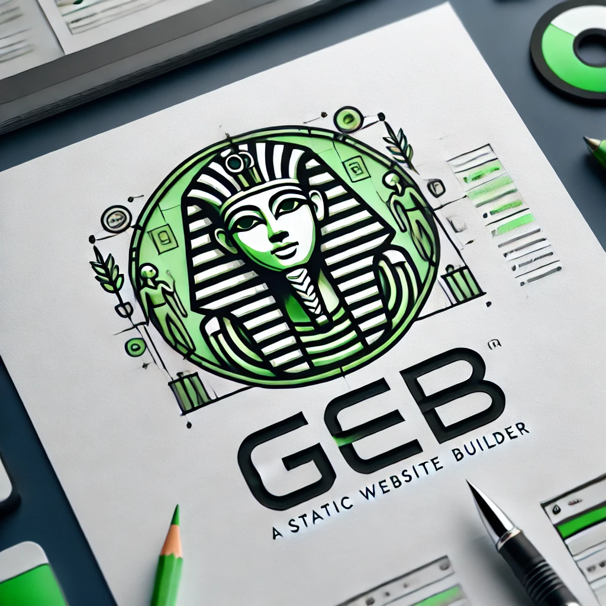

# Geb

Geb is a powerful and intuitive static website manager and builder named after the ancient Egyptian god Geb, the deity of the Earth. Just as Geb provides a stable foundation for the world, our software offers a robust and essential foundation for building and managing static websites, which form the very bedrock of the web.

Geb provides a seamless command line interface, making it easy to create, build, and manage your static websites with efficiency and ease. Whether you are a seasoned developer or a beginner, Geb provides the tools and templates to help you get started quickly and effectively.



With Geb, you can harness the power of site templates to streamline your workflow, ensuring your websites are not only beautiful but also maintainable. Our built-in templates, along with the ability to use previous projects as templates, provide unparalleled flexibility and reusability, enabling you to focus on what matters most: creating amazing content and user experiences.

## Table of Contents

- [Installation](#installation)
- [Usage](#usage)
- [Geb Site Configuration](#geb-site-configuration)
- [Site Templates](#site-templates)
  - [Built-in site templates](#built-in-site-templates)
  - [Previous project as a template](#previous-project-as-a-template)
  - [Publishing and using templates](#publishing-and-using-templates)
- [Basic Site Structure](#basic-site-structure)
- [Pages, Templates and Partials](#pages-templates-and-partials)
  - [Page Example](#page-example)
  - [Template Example](#template-example)
  - [Partial Example](#partial-example)
  - [Result Page](#result-page)
  - [Discussion and key takeaways](#discussion-and-key-takeaways)
- [Command Reference](#command-reference)
- [Roadmap](#roadmap)
- [Development](#development)
- [Contributing](#contributing)
- [License](#license)
- [Code of Conduct](#code-of-conduct)

## Installation

Installing geb is as simple as installing a Ruby Gem
```bash
$ gem install geb
```

If you would like to install geb from source, follow the following steps
```bash
# clone the repository
$ git clone https://github.com/mainfram-work/geb.git
$ cd geb

# install dependencies
$ bundle install

# make sure everything works
$ rake test

# build and install the geb gem
$ rake build
$ rake install
```

## Usage

Geb has several commands to help you manage your site. running "geb help" will list the available commands.
```bash
$ geb help
Commands:
  geb build                    # Build the full site, includes pages and assets
  geb init SITE_PATH           # Initialise geb site, creates folder locations, git repository and initial file structures
  geb release                  # Builds the release version of the site (pages and assets)
  geb remote                   # Launch remote ssh session using the config file settings
  geb server                   # Start a local server to view the site output (runs build first), uses webrick
  geb upload                   # Upload the site to the remote server
  geb version                  # Print version
```

To get help for a particular command simply run.
```bash
$ geb [command] --help
```

The basic geb workflow is as follows.

```bash
# initialize a new site in the directory nexthing
$ geb init nexthing
$ cd nexthing

# build the site
$ geb build

# start a local web server to access your built site
$ geb server

# build a release version of the site
$ geb release

# upload the released site to your remote server
$ geb upload
```

All geb commands (other than the `geb init` command) are executed with the project directory. Geb looks for the site root by finding the `geb.config.yml` file up the directory tree.

## Geb Site Configuration

Every Geb site has a configuration file at the root of the site.  The file is called `geb.config.yml`
The geb command will use values in the configuration file over the default values in almost all cases.

Check out a [sample geb configuration file](lib/geb/samples/geb.config.yml) for a detailed description of all configuration items.

## Site Templates

### Built-in site templates

Geb has a concept of site templates.  Think of it as a way to share site designs, libraries and content.
Geb comes with a set of site templates, distributed with the geb gem. These are:

- **basic** - this is a default template, that provides a simple site structure and placeholders for various concepts such as headers, footers, javascript and CSS and so on.
- **bootstrap_jquery** - a site template with Bootstrap 5 and JQuery 3.7, along with example pages.

To use one of the built-in templates, simply pass the name to the `geb init` command
```bash
$ geb init new_site --template bootstrap_jquery
```
If you do not specify a site template, geb will use the **basic** template that comes bundled with the geb gem.

### Previous project as a template

Site templates can also be other sites you have developed. To use a previous project as a basis for some new project, you will need the following.  

First, the project you wish to use as a template needs to have `template_paths` configured within its `geb.config.yml` file. 
Here is an example.
```yaml
# if you want to share the site as a template site, specify which files and directories 
# are part of the template.
template_paths: ["assets", "shared", "*.html", "site.webmanifest"]
```

To use a previous project as a site template, simply pass it to the `geb init` command
```bash
$ geb init new_site --template ~/projects/other_site
```

### Publishing and using templates

To publish the site template along with your site, you will need to specify the `template_paths` configuration within the `geb.config.yml` file and package the template using the `geb release` command
```bash
$ cd ~/projects/new_site
$ geb release --with_template
```
Geb will generate `geb-template.tar.gz` within the site release directory, which you can then upload using `geb upload` command or what other mechanisms you plan to use to deploy the finished site.

To use an already published template, simply pass the site URL to `geb init` command.
```bash
$ geb init new_site --template http://www.some_website.com/
```

You can either pass the URL to the *geb-template.tar.gz*.  Geb will try the URL first and if it doesn't find `geb-template.tar.gz` it will append the filename and try again.

## Basic Site Structure
You can structure a Geb site however you want. The only required directories are `assets` and `output` with `local` and `release` sub-directories.  `geb init` command will create these directories.
```
new_site
  ├── assets                    # [required] assets directory for images, css, js, etc.
    ├── images                  # images directory
      ├── css                   # css directory
      ├── js                    # js directory
  ├── blog                      # just a directory to hold blog posts 
    ├── index.html              # the blog index page
    ├── blog_post_1.html        # a sample blog post
  ├── geb.config.yml            # [required] the site configuration file   
  ├── index.html                # site index pag, this page
  ├── page.html                 # another page
  ├── output                    # [required] the directory where the built site is output
    ├── local                   # [required] local build directory, server command uses this as root
    ├── release                 # [required] release build directory, upload command uploads from here
  ├── shared                    # shared directory for partials, templates, etc.
    ├── partials                # partials directory
      ├── _analytics.html       # partial with site analytics
      ├── _footer.html          # footer partial
      ├── _global_assets.html   # global assets partial (js and css references)
      ├── _header.html          # header partial
      ├── _meta_tags.html       # site mata tags partial
    ├── templates               # templates directory
      ├── _blog_post.html       # template for blog pages
      ├── _site.html            # template for general site pages
  ├── site.webmanifest          # site webmanifest file
```
All references to assets (image, css, js, etc) as well as links should be **relative **to the **site's** root****

Files that start with _ are partials or templates and are not meant to be served directly.
You won't see these files in the output directory.

It is possible to configure geb to use different directories for assets or output. 
However, `geb.config.yml` must be updated to reflect these changes and be located in the site root. 
Check the [sample geb configuration file](lib/geb/samples/geb.config.yml) for more information.

The rest is up to you.  We like the convention of putting partials and templates in the 
shared directory, but you can put them anywhere. You can create any directory structure
that makes sense for your site. 

## Pages, Templates and Partials

 Below are some examples of how to use pages, templates and partials with Geb.
 Read the examples first, then the discussion located after the examples.
### Page Example
Here is a simple page example, in the above site structure this might be `index.html` file
 ```erb
 <% template: shared/templates/_site.html %>

<% start: title %>
  Page Title
<% end: title %>

<% start: content %>
  This is page content
  <% partial: shared/partials/_featured_product.html %>
<% end: content %>
 ```
 ### Template Example
 This is a page template example, in the above site structure this might be `shared/templates/_site.html`
 ```erb
<!DOCTYPE html>
<html>
  <head>
    <title><% insert: title %></title>
    <% partial: shared/partials/_analytics.html %>
    <% partial: shared/partials/_meta_tags.html %>
    <% partial: shared/partials/_global_assets.html %>
   </head>
  <body>
    <% partial: shared/partials/_header.html %>
    <% insert: content %>
    <% partial: shared/partials/_footer.html %>
  </body>
</html>
 ```
 ### Partial Example
 This is a page partial example, in the above site structure it could be any file in the `shared/partials` directory.
 ```erb
<h1>Best Product Ever<h1>
<p>This is the best product ever</p>
<% partial: shared/partials/_product_analytics.html %>
```
### Result Page
Below is the Page Example above, processed by `geb build` command.
```html
 <!DOCTYPE html>
<html>
  <head>
    <title>Page Title</title>
    <!-- content from shared/partials/_analytics.html -->
    <!-- content from shared/partials/_meta_tags.html -->
    <!-- content from shared/partials/_global_assets.html -->
  </head>
  <body>
    <!-- content from shared/partials/_header.html -->
    This is page content
    <h1>Best Product Ever<h1>
    <p>This is the best product ever</p>
    <!-- content from shared/partials/_product_analytics.html -->
    <!-- content from shared/partials/_footer.html -->
  </body>
</html>
```
### Discussion and key takeaways

  - Pages are the actual content of the site. They are the only files that are served directly.
  - The example page above uses a template found in /shared/templates/_site.html
  - Templates are used to wrap pages in a common structure. They are not served directly.
  - The example template above has two content blocks, title and content.
  - The page above has those content areas filled in with whatever is required
  - Page start: what_ever_name and template insert: what_ever_name must have matching "names"
  - If a page uses a template, the template must be defined at the top of the page.
  - If a page uses a template, any content not in a "start: what_ever_name" -> "end: what_ever_name" block is ignored.
  - Obviously, the "start: what_ever_name" -> "end: what_ever_name" must have matching "names"
  - Partials are used to include common content in pages and templates. They are not served directly.
  - Partials can be nested, but be careful not to create circular references.
  - That's about it... happy coding!

## Command Reference

### geb build
Build the full site, includes pages and assets.
```bash
$ geb build [--skip_assets] [--skip_pages]
```
- `--skip_assets`: Skip building assets (images, css, js)
- `--skip_pages`: Skip building pages

### geb init
Initialise geb site, creates folder locations, git repository and initial file structures.
```bash
$ geb init SITE_PATH [--template=VALUE] [--skip-template] [--skip-git] [--force]
```
- `--template=VALUE`: Template site, either a path or one of the following: bootstrap_jquery, basic
- `--[no-]skip-template`: Skip generating a site from template
- `--[no-]skip-git`: Skip initialising git repository
- `--[no-]force`: Force overwrite of existing files and git repository

### geb release
Builds the release version of the site (pages and assets).
```bash
$ geb release [--with_template]
```
- `--with_template`: Build the release site with a template archive

### geb remote
Launch remote ssh session using the config file settings.
```bash
$ geb remote
```

### geb server
Start a local server to view the site output (runs build first), uses webrick.
```bash
$ geb server [--port=PORT] [--skip-build] [--skip-auto-build]
```
- `--port=PORT`: Port to run the server on
- `--[no-]skip-build`: Skip building the site before starting the server
- `--[no-]skip-auto-build`: Don't automatically rebuild the site when a file changes

### geb upload
Upload the site to the remote server.
```bash
$ geb upload
```

### geb version
Print the current version of Geb.
```bash
$ geb version
```

## Roadmap

This roadmap outlines the planned features and improvements for future versions of Geb. The timeline and features are subject to change based on feedback and development priorities.

### Version 0.3.0
**Target Release Date:** Sometime in September 2024

**Planned Features**
- **Template Enhancements**: Improve the existing templates and add more templates for various types of websites.
- **Plugin Support**: Introduce a plugin system to extend Geb's functionality.
- **Improved Documentation**: Expand the documentation with more examples and tutorials.

**Improvements**
- **Windows Support**: Test and build Geb on windows operating system
- **Better Testing**: Ability to better test `geb upload` and `geb remote` commands.

## Development

After checking out the repo, run `bin/setup` which just runs `bundle install` to install dependencies. Then, run `rake test` to run the tests. You can also run `bin/console` for an interactive prompt that will allow you to experiment.

Gab has the following dependencies

 - `Ruby >= 3.0.0`
 - [dry/cli](https://dry-rb.org/gems/dry-cli/1.0/) - a general-purpose framework for developing Command Line Interface (CLI) applications.
 - [Webrick](https://github.com/ruby/webrick) - an HTTP server toolkit that can be configured as an HTTPS server, a proxy server, and a virtual-host server.
 - [Listen](https://github.com/guard/listen) - gem listens to file modifications and notifies you about the changes.

 The development environment has the following dependencies:

 - [Rake](https://ruby.github.io/rake/) - a Make-like program implemented in Ruby. 
 - [minitest](https://github.com/minitest/minitest) - provides a complete suite of testing facilities supporting TDD, BDD, mocking, and benchmarking.
 - [webmock](https://github.com/bblimke/webmock) - library for stubbing and setting expectations on HTTP requests in Ruby.
 - [mocha](https://github.com/freerange/mocha) - a Ruby library for mocking and stubbing.
 - [simplecov](https://github.com/simplecov-ruby/simplecov) - a code coverage analysis tool for Ruby.
 - [yard](https://yardoc.org) - a Ruby documentation tool.

To install this gem onto your local machine, run `bundle exec rake build` and then `bundle exec rake install`. To release a new version, update the version number in `version.rb`, and then run `bundle exec rake release`, which will create a git tag for the version, push git commits and the created tag, and push the `.gem` file to [rubygems.org](https://rubygems.org).

## Contributing
Bug reports and pull requests are welcome on GitHub at https://github.com/mainfram-work/geb. This project is intended to be a safe, welcoming space for collaboration, and contributors are expected to adhere to the [code of conduct](https://github.com/mainfram-work/geb/blob/main/CODE_OF_CONDUCT.md).

## License

The gem is available as open source under the terms of the [MIT License](https://opensource.org/licenses/MIT).

## Code of Conduct

Everyone interacting in the Geb project's codebases, issue trackers, chat rooms and mailing lists is expected to follow the [code of conduct](https://github.com/mainfram-work/geb/blob/main/CODE_OF_CONDUCT.md).


